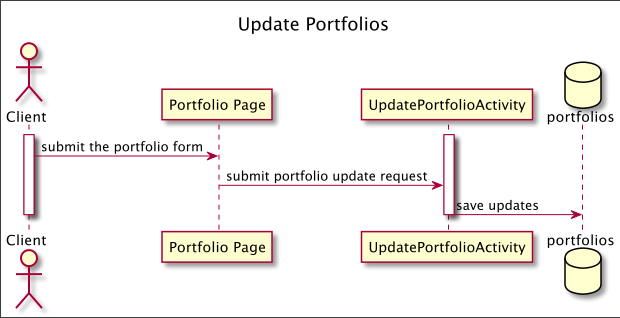

# Crypto Wizards Design Document

## Crypto Portfolio Tracker Design

## 1. Problem Statement

Crypto assets are digital tokens secured through a decentralized computer network. Owning several crypto assets can be difficult to track and view overall value and performance.

This design document describes a crypto portfolio tracking service that provides a custom view of the client's portfolio to meet their needs. It is designed to connect with a 3rd party price quoting service, displaying realtime data converted to USD to see an accurate asset value. This will keep track of all assets in a single location with historical data to view growth and regression.


## 2. Top Questions to Resolve in Review

1. How should daily historical data be calculated with a volatile market?   
2. How to fix a top 50 asset view for client with a larger number on backend with consistent changes?
3. How implement a secure login with registration page and verify if access token is still valid? 

## 3. Use Cases

U1. As a customer, I want to create a new portfolio from a list of assets when I log 
into the site.

U2. As a customer, I want to view a portfolio holding all my assets with realtime value 
converted to USD.
    
U3. As a customer, I want to update my list of assets in my portfolio.

U4. As a customer, I want to view historical data showing asset performance.

## 4. Project Scope

### 4.1. In Scope

* Creating, retrieving, and updating a portfolio.
* Retrieving the historical data of the portfolio.
* Retrieving the historical data showing asset performance.

### 4.2. Out of Scope

* Buying and selling of assets.

# 5. Proposed Architecture Overview

This initial iteration will provide creating, retrieving, and updating a user's portfolio, as well as viewing the historical data of the portfolio and the assets to gauge the overall performance over a period of time.

We will use API Gateway and Lambda to create eight endpoints (`Register`,`Login`, `Verify`, `CreatePortfolioActivity`, `GetPortfolioActivity`, `UpdatePortfolioActivity`, `GetPortfolioHistoryActivity`, `GetAssetHistoryActivity`) that will handle the creation, update, and retrieval of portfolio along with the retrieval of the historical data to satisfy our requirements.

We will store the assets available for the portfolio in a table in DynamoDB. The portfolios themselves will also be stored in DynamoDB. 

CryptoPortfolioTracker will also provide a web interface for users to manage their portfolios. A main page providing  a list view will let them create new portfolios and link off to pages to update assets, view assets and view historical Data.

# 6. API

## 6.1. Public Models
```
//PortfolioModel

String userId;
String assetId;
Integer assetQuantity;

//AssetModel

String assetId;
Integer marketCap;
String assetImage;
String assetName;
Integer totalSupply;
Integer usdValue;
boolean isAvailable;

```

## 6.2. Register Endpoint

* Accepts `POST` request to `/register`.
* Returns a "User Successfully Created" response after successfully validating the provided information.
* If the given User ID has invalid characters, will throw an
  `InvalidAttributeValueException`
* If the provided password has invalid characters, will throw an
  `InvalidAttributeValueException`
* If the User already exists, will throw a 
  `UserAreadyExistsException`


## 6.3. Login Endpoint

* Accepts a `POST` request to `/login`.
* Returns a successful authentication.
* If the given User ID is not found, will throw a
  `UserNotFoundException`
* If the provided password is incorrect, will throw an
  `InvalidPasswordException`


## 6.4. Verify Endpoint
* Accepts `POST` request  to `/verify`.
* Verifies if Access token is still valid.
  * If the session has expired, will throw an
    `SessionExpiredException`

## 6.5. GetPortfolioActivity Endpoint

* Accepts `GET` requests to `/portfolios/:id`
* Accepts a User ID and returns the corresponding PortfolioModel.


## 6.6. CreatePortfolioActivity Endpoint

* Accepts `POST` requests to `/portfolios`
* Accepts data to create a new portfolio for the provided userName, with the selected list of Assets.
* Returns the new portfolio along with the total value of the assets.
    * If the user enters the number of assets to be more than that available in the market, will throw an
      `InsufficientAssetsException`.


### 6.7. UpdatePortfolioActivity Endpoint

* Accepts `PUT` requests to `/portfolios/:id`
* Accepts data to update the quantity of portfolio owned and adding new assets to the portfolio. Returns the updated portfolio.
    * If the user enters the number of assets to be more than that available in the market, will throw an
      `InsufficientAssetsException`.



### 6.8. GetPortfolioHistoryActivity Endpoint
* Accepts `GET` requests to `/portfolios/:id/history`
* Accepts a valid User ID and returns the corresponding Portfolio's historical data'.


# 7. Tables

### 7.1. `users`
```
username // partition key, string
password // string
```

### 7.2.  `portfolios`
```
username // partition key ,string
asset_id // string
asset_quantity // number
```

### 7.3.  `assets`
```
asset_id // partition key, string
rank_by_market_cap // sort key, number
market_cap // number
asset_image // string
asset_name // string
total_supply // number
usd_value // number
is_available // boolean
```

### 7.4.  `asset_history`
```
* asset_id // partition key, string
* time_stamp // sort key, string
* usd_value: // string
```

### 7.5.  `portfolio_history`
```
username // partition key, string
time_stamp // sort key, string
port_folio // String Set
```

### 7.6.  `consolidated_portfolio_history`
```
username // partition key, string
time_stamp // sort key, string
total_usd_value: number
```

# 8. Pages


