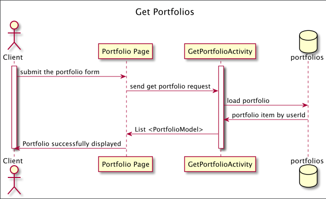

# Crypto Wizards Design Document

## Crypto Portfolio Tracker Design

## 1. Problem Statement

Crypto assets are digital tokens secured through a decentralized computer network. Owning several crypto assets can be difficult to track and view overall value and performance.

This design document describes a crypto portfolio tracking service that provides a custom view of the client's portfolio to meet their needs. It is designed to connect with a 3rd party price quoting service, displaying realtime data converted to USD to see an accurate asset value. This will keep track of all assets in a single location with historical data to view growth and regression.


## 2. Top Questions to Resolve in Review
 
1. How to fix a top 50 asset view for client with a larger number on backend with consistent changes?
2. How implement a secure login with registration page and verify if access token is still valid? 

## 3. Use Cases

U1. As a customer, I want to create a new portfolio from a list of assets when I log 
into the site.

U2. As a customer, I want to view a portfolio holding all my assets with realtime value 
converted to USD.
    
U3. As a customer, I want to update my list of assets in my portfolio.

## 4. Project Scope

### 4.1. In Scope

* Creating, retrieving, and updating a portfolio.

### 4.2. Out of Scope

* Buying and selling of assets.

# 5. Proposed Architecture Overview

This initial iteration will provide creating, retrieving, and updating a user's portfolio.

We will use API Gateway and Lambda to create six endpoints (`RegisterActivity`,`LoginActivity`, `VerifyActivity`, `CreatePortfolioActivity`, `GetPortfolioActivity`, `UpdatePortfolioActivity`) that will handle the creation, update, and retrieval of portfolio to satisfy our requirements.

We will store the assets available for the portfolio in a table in DynamoDB. The portfolios themselves will also be stored in DynamoDB. 

CryptoPortfolioTracker will also provide a web interface for users to manage their portfolios. A main page providing  a list view will let them create new portfolios and link off to pages to update and view assets.

# 6. API

## 6.1. Public Models
```
//PortfolioModel

String userId;
String assetId;
Integer assetQuantity;

//AssetModel

String assetId;
int rankByMarketCap;
double marketCap;
String assetImage;
String assetName;
String assetSymbol;
double totalSupply;
double usdValue;
double priceChangePercentage24h;

//UserModel

String username;
String password;
Boolean isNewUser;

```

## 6.1. Register Endpoint

* Accepts `POST` request to `/register`.
* Returns the "Username" response after successfully validating the provided information.
  * If either the Username or Password field is empty, will throw
    `MissingFieldException`
  * If the User already exists, will throw a
      `UserAreadyExistsException`
  * If the given User ID has invalid characters, will throw an
    `InvalidAttributeValueException`
  * If the provided password has invalid characters, will throw an
    `InvalidAttributeValueException`


## 6.2. Login Endpoint

* Accepts a `POST` request to `/login`.
* Returns a successful authentication.
  * If the given User ID is not found, will throw a
    `LoginException :  user does not exist`
  * If the provided password is incorrect, will throw an
    `LoginException : incorrect password`


## 6.3. Verify Endpoint
* Accepts `POST` request  to `/verify`.
* Verifies if Access token is still valid.
  * If either the Username or token field is empty, will throw
    `AuthenticationException`
  * If the session token has expired, will throw
    `AuthenticationException : Token expired`
  * If the session token is incorrect, will throw
      `AuthenticationException :  token could not be verified`

## 6.4. GetPortfolioActivity Endpoint

* Accepts `GET` requests to `/portfolios/:id`
* Accepts a User ID and returns the corresponding PortfolioModel.
  * If portfolio is not found, will throw
    `PortfolioNotFoundException`




## 6.5. CreatePortfolioActivity Endpoint

* Accepts `POST` requests to `/portfolios`
* Accepts data to create a new portfolio for the provided userName, with the selected list of Assets.
* Returns the new portfolio along with the total value of the assets.
    * If the user enters an asset that is unavailable, will throw an
      `AssetNotAvailableException`.
    * If the user already has a portfolio and still attempts to create one, will throw
      `PortfolioAlreadyExistsException`
    * If the profolio fails to get saved due to Internal dynamo Db server error, will throw
    `UnableToSaveToDatabaseException`


### 6.6. UpdatePortfolioActivity Endpoint

* Accepts `PUT` requests to `/portfolios/:id`
* Accepts data to update the quantity of portfolio owned and adding new assets to the portfolio. Returns the updated portfolio.
    * If the user enters an asset that is unavailable, will throw an
      `AssetNotAvailableException`.
    * If the user already has a portfolio and still attempts to create one, will throw
      `PortfolioAlreadyExistsException`
    * * If the profolio fails to get saved due to Internal dynamo Db server error, will throw
        `UnableToSaveToDatabaseException`


# 7. Tables

### 7.1. `users`
```
username // partition key, string
password // string
is_new_user // boolean
```

### 7.2.  `portfolios`
```
username // partition key ,string
asset_quantity_map // Map <string, Integer>
```

### 7.3.  `assets`
```
asset_id // partition key, string
rank_by_market_cap // sort key, number
market_cap // number
asset_image // string
asset_name // string
asset_symbol // String
total_supply // number
usd_value // number
price_change_percentage_24h // Double

```

# 8. Pages


